## About this Admin Panel

+ This panel was developed by Lucas Silva - Can edit the credits, but do not sell without authorization! Contact us in
  license@webzow.com

This panel was developed in order to manage WarZ/Infestation server via Web Interface in an easy and practical way.

List of some features:

> The Panel
> - Login only Staff (isDeveloper).
> - Dashboard.
> - List and Update Accounts (only required data-info).
> - List Premium Accounts.
> - List Developers Accounts.
> - List Banneds Accounts.
> - List Top 500 Users GC.
> - List Top 500 Users GD.
> - List and Update Skilltree Prices.
> - List and Update Characters Prices.
> - List and Update Marketplace Prices.
> - List all Marketplace by Category.
> - List, Update and Add Loot Spawns.
> - Language System (English, Portuguese)

> API
> - An API so you can do everything Frontend does, through third-party services. (Postman, Discord BOT and so on...)
> - API versioning system. This system was developed to support versioning without affecting previous versions.
> - Configure external API access. (Authorize IP to access your API)

> Core & Security
> - License system to prevent piracy. (you can revoke your key and generate a new one for your new IP address internally
    in the panel)
> - Notification system about updates of this project.

---

## Screenshots

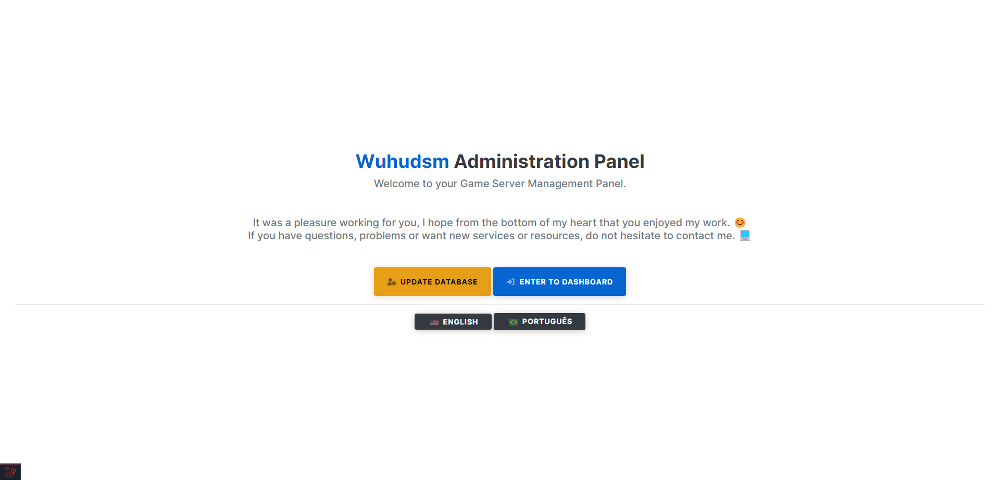

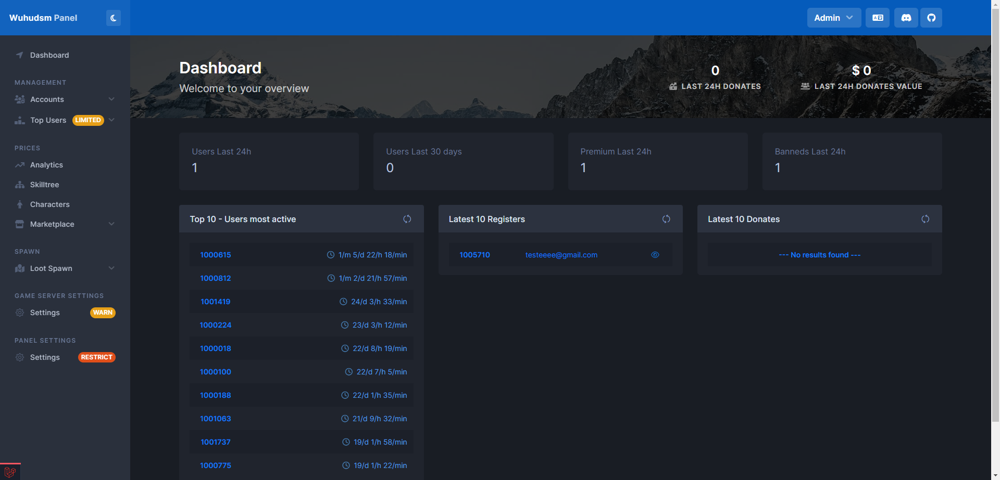
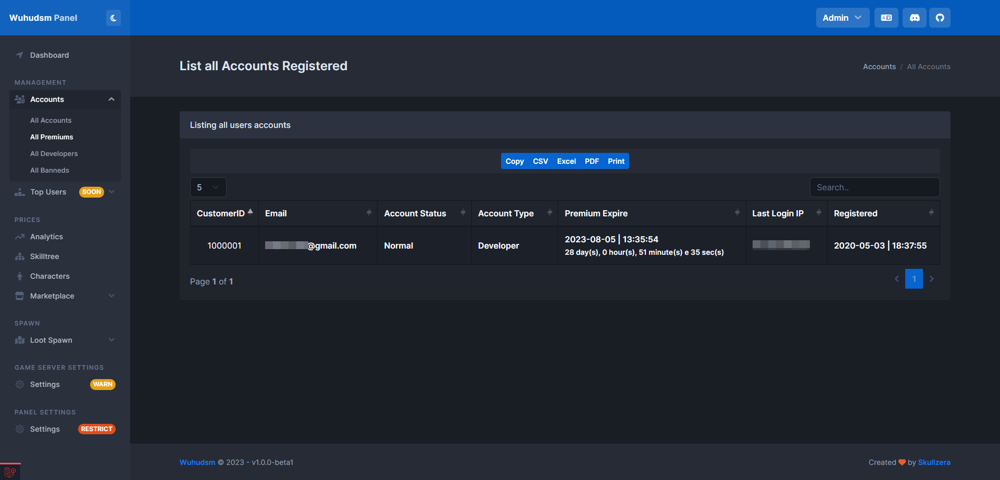
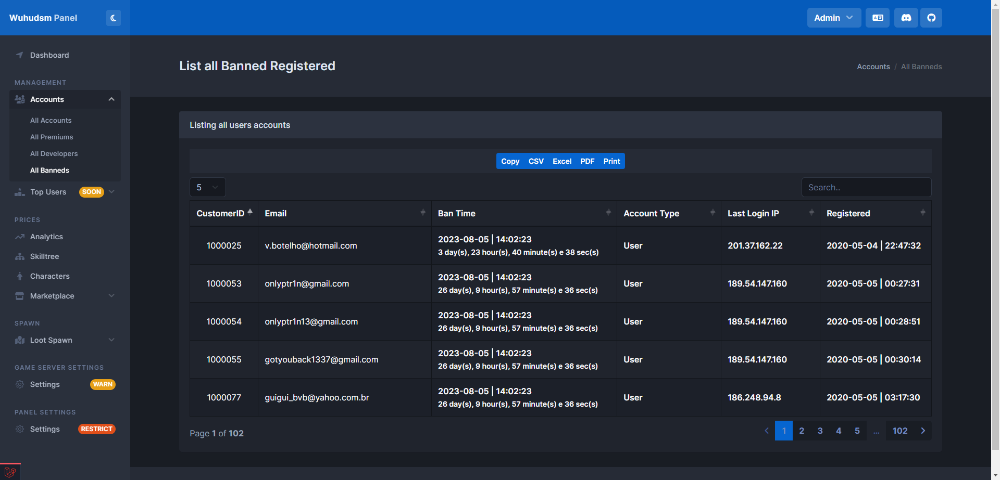
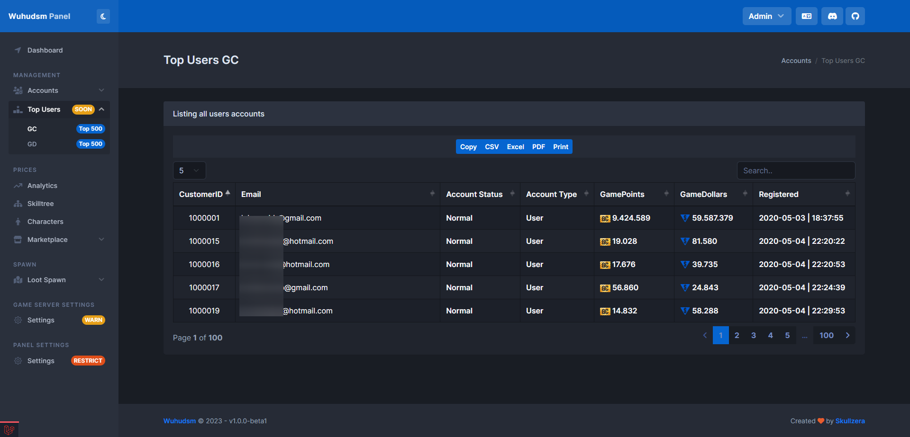

## Notify for new update

* No update available

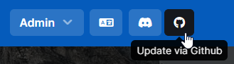

* New update available!

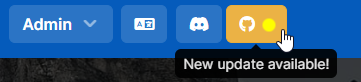

## Notify for new Database update (migitation)

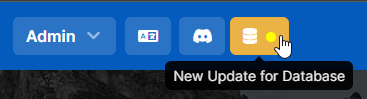
---

## User renew self license

> Check Wiki page for more info.

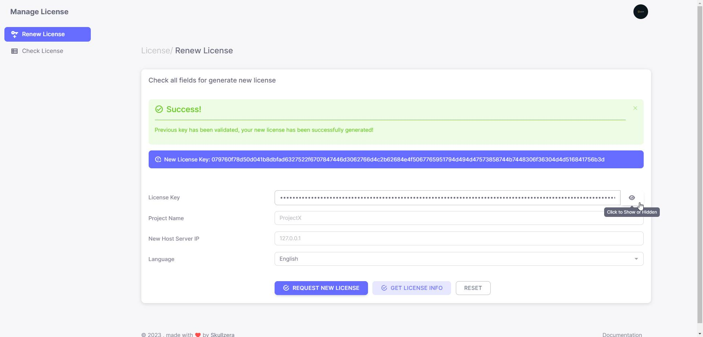

## How to install

- Extract the Git on your Host (public_html, httpd, html etc)
- Open PHP Extension checker from http://your-domain.com/loader-wizard.php
- Check extension for your PHP and set in PHP.ini the instructions (Eg: zend_extension="E:
  \PHP\v7.4\ext\ioncube_loader_win_7.4.dll")
- Open installer from http://your-domain.com/install
- Follow the steps and done.

> If you need help, contact us at contato@webzow.com

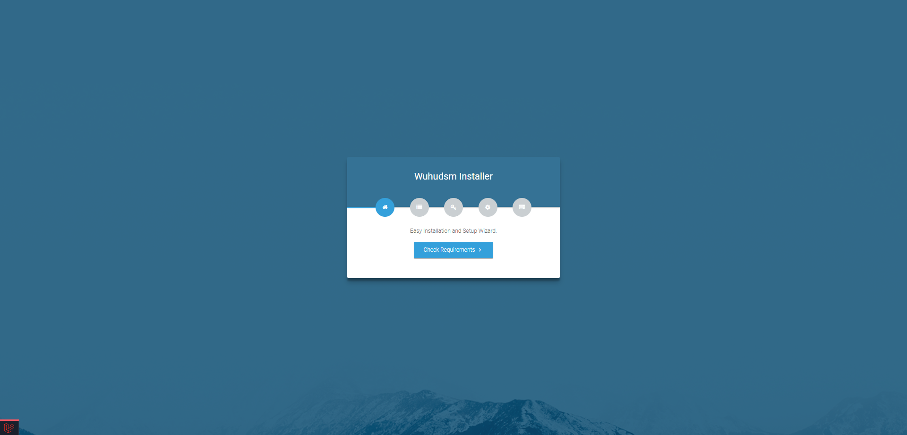
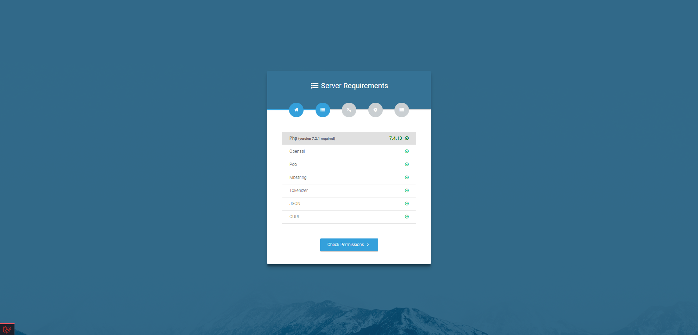
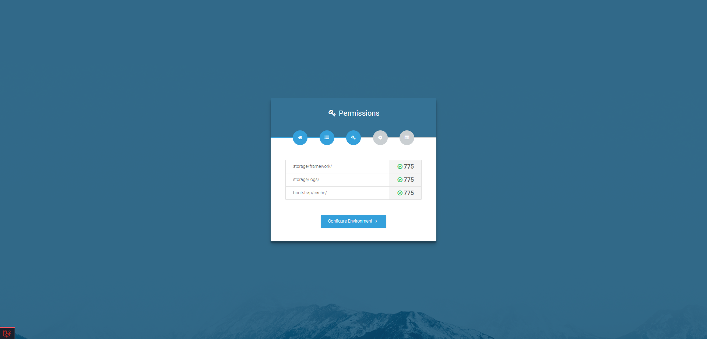

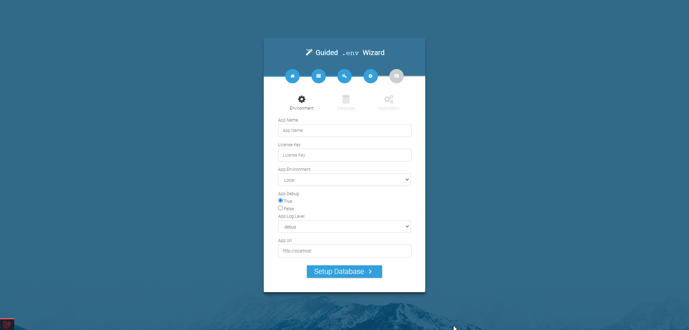
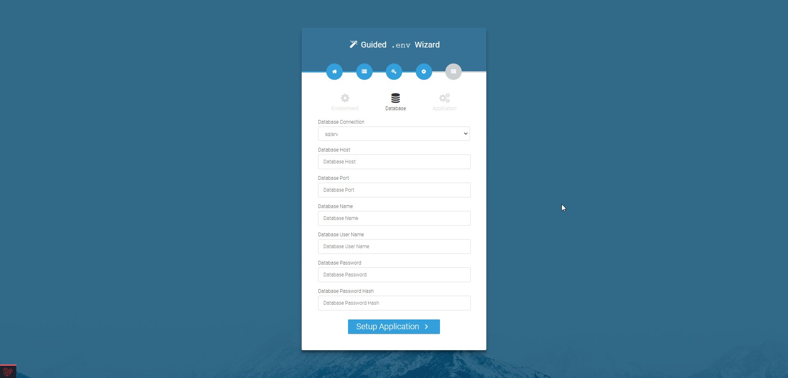

---

Laravel Framework 5.8.38

## About Laravel

Laravel is a web application framework with expressive, elegant syntax. We believe development must be an enjoyable and
creative experience to be truly fulfilling. Laravel takes the pain out of development by easing common tasks used in
many web projects, such as:

- [Simple, fast routing engine](https://laravel.com/docs/routing).
- [Powerful dependency injection container](https://laravel.com/docs/container).
- Multiple back-ends for [session](https://laravel.com/docs/session) and [cache](https://laravel.com/docs/cache)
  storage.
- Expressive, intuitive [database ORM](https://laravel.com/docs/eloquent).
- Database agnostic [schema migrations](https://laravel.com/docs/migrations).
- [Robust background job processing](https://laravel.com/docs/queues).
- [Real-time event broadcasting](https://laravel.com/docs/broadcasting).

Laravel is accessible, powerful, and provides tools required for large, robust applications.

## Learning Laravel

Laravel has the most extensive and thorough [documentation](https://laravel.com/docs) and video tutorial library of all
modern web application frameworks, making it a breeze to get started with the framework.

If you don't feel like reading, [Laracasts](https://laracasts.com) can help. Laracasts contains over 1500 video
tutorials on a range of topics including Laravel, modern PHP, unit testing, and JavaScript. Boost your skills by digging
into our comprehensive video library.

## Laravel Sponsors

We would like to extend our thanks to the following sponsors for funding Laravel development. If you are interested in
becoming a sponsor, please visit the Laravel [Patreon page](https://patreon.com/taylorotwell).

- **[Vehikl](https://vehikl.com/)**
- **[Tighten Co.](https://tighten.co)**
- **[Kirschbaum Development Group](https://kirschbaumdevelopment.com)**
- **[64 Robots](https://64robots.com)**
- **[Cubet Techno Labs](https://cubettech.com)**
- **[Cyber-Duck](https://cyber-duck.co.uk)**
- **[British Software Development](https://www.britishsoftware.co)**
- **[Webdock, Fast VPS Hosting](https://www.webdock.io/en)**
- **[DevSquad](https://devsquad.com)**
- [UserInsights](https://userinsights.com)
- [Fragrantica](https://www.fragrantica.com)
- [SOFTonSOFA](https://softonsofa.com/)
- [User10](https://user10.com)
- [Soumettre.fr](https://soumettre.fr/)
- [CodeBrisk](https://codebrisk.com)
- [1Forge](https://1forge.com)
- [TECPRESSO](https://tecpresso.co.jp/)
- [Runtime Converter](http://runtimeconverter.com/)
- [WebL'Agence](https://weblagence.com/)
- [Invoice Ninja](https://www.invoiceninja.com)
- [iMi digital](https://www.imi-digital.de/)
- [Earthlink](https://www.earthlink.ro/)
- [Steadfast Collective](https://steadfastcollective.com/)
- [We Are The Robots Inc.](https://watr.mx/)
- [Understand.io](https://www.understand.io/)
- [Abdel Elrafa](https://abdelelrafa.com)
- [Hyper Host](https://hyper.host)

## Contributing

Thank you for considering contributing to the Laravel framework! The contribution guide can be found in
the [Laravel documentation](https://laravel.com/docs/contributions).

## Security Vulnerabilities

If you discover a security vulnerability within Laravel, please send an e-mail to Taylor Otwell
via [taylor@laravel.com](mailto:taylor@laravel.com). All security vulnerabilities will be promptly addressed.

## License

The Laravel framework is open-source software licensed under the [MIT license](https://opensource.org/licenses/MIT).
